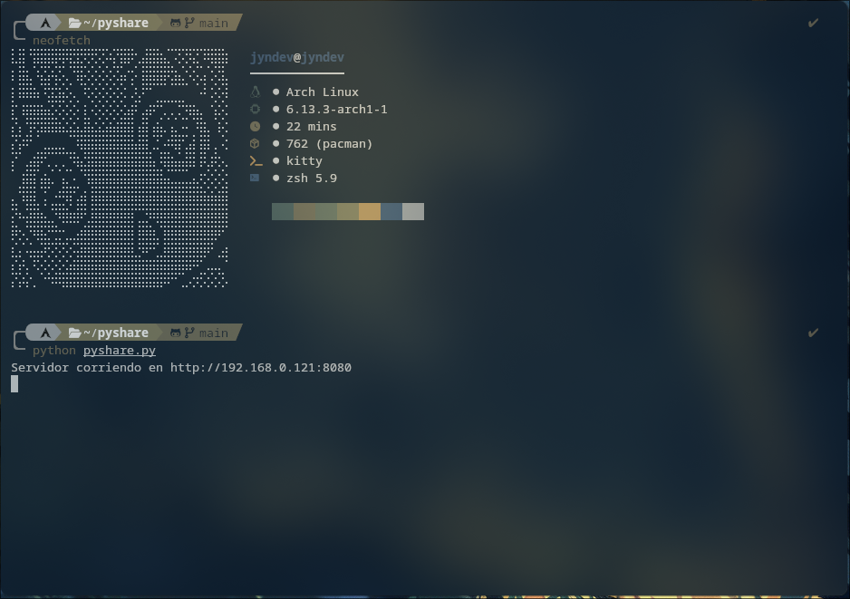
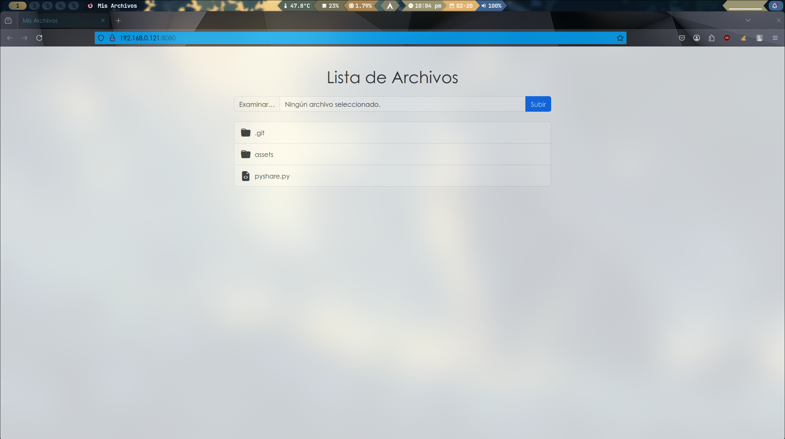

# JynDev - PyShare 🐍

## 📡 Transferencia de archivos a través de una red local 👨‍💻️🛠️

**PyShare** es una herramienta sencilla creada con la ayuda de **ChatGPT** para facilitar el intercambio de archivos entre dispositivos sin necesidad de cables. Utiliza una **red local o Wi-Fi** como medio de transferencia, lo que en muchos casos resulta más rápido que los métodos tradicionales.

No la desarrollé completamente por mi cuenta; recurrí a la inteligencia artificial para optimizar su creación, analizar el código y comprender su funcionamiento. Ahora la pongo a disposición de quien desee utilizarla.

✔️ **Sube y descarga archivos fácilmente** desde cualquier dispositivo conectado a la misma red.  
✔️ **Interfaz web intuitiva** para gestionar los archivos sin complicaciones.

💪 ¡Gracias a todos por el apoyo! 🚀

---

## 🛠 Instalación

1. Asegúrate de tener **Python 3** instalado en tu equipo.
2. Descarga el archivo **pyshare.py**.
3. Copia el archivo en la ubicación donde tienes los archivos que deseas compartir.
4. Ejecuta el script con el siguiente comando:

   ```bash
   python pyshare.py
   ```

   Si todo funciona correctamente, deberías ver algo como esto:
   </img>
   

5. Se mostrará la **IP local** de tu máquina con la URL que debes usar en los dispositivos donde quieres acceder a los archivos.

---

## 🌐 Interfaz web

Una vez en la URL proporcionada, verás una interfaz similar a esta:
</img>

Desde ahí, podrás subir y descargar archivos de forma rápida y sencilla.

---

## 📜 Licencia

Este proyecto es de código abierto y puedes utilizarlo libremente. Si te resulta útil, ¡no dudes en compartirlo o mejorarlo! 😃

---

🚀 **Contribuciones y mejoras son bienvenidas. ¡Gracias por tu apoyo!**
